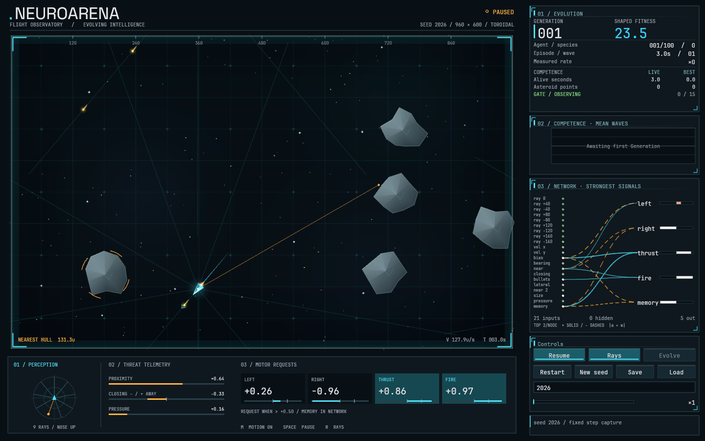
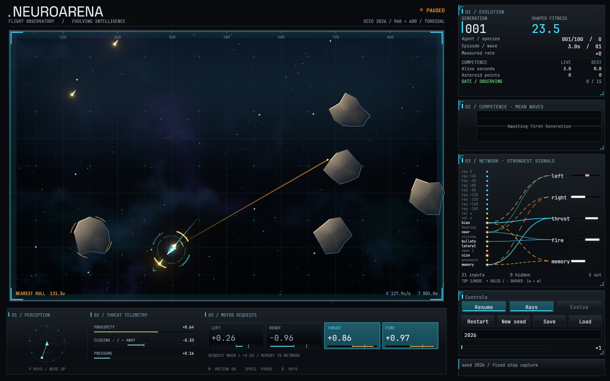

# NeuroArena — the luminous field

2026-09-13 · Apple M5 · macOS 26.4 (Darwin 25.4) · Rust 1.98.1 · native winit 0.30 / wgpu 30 / Metal

## Result and scope

The running application's presentation was rebuilt on a **high-dynamic-range frame graph with physically-motivated bloom**, and the Arena was re-art-directed around it: a procedural deep field, rock as a lit material, and a signature instrument that puts the Agent's perception and its motor requests on the hull itself. The simulation is untouched and its outputs are byte-identical.

Launch with `cargo run --release --bin neuroarena`. Nothing was pushed or committed.

|                                                         |                                                       |
| ------------------------------------------------------- | ----------------------------------------------------- |
|  |  |

Both captures: seed 2026, Generation 1, member 0, fixed step 180, 1440×900 at 1× display scale, paused presentation, Rays on, produced by the deterministic offscreen probe (`visual_probe`) driving the real renderer. The "before" was rendered from `b252b11` in a throwaway `git worktree`, so the pair differs only by this pass's code.

## 1 · Audit

The audit was made against the running application and against the deterministic captures above, not against the source alone.

| Priority | Finding                                                                                                                                                                                                                                       | Evidence                                                                        | Resolution                                                                                       |
| -------- | --------------------------------------------------------------------------------------------------------------------------------------------------------------------------------------------------------------------------------------------- | ------------------------------------------------------------------------------- | ------------------------------------------------------------------------------------------------ |
| High     | **Nothing in the Arena is a light source.** The additive buffer exists, but the target is 8-bit sRGB, so a bullet's core, a plume and a panel's white text are all clamped to the same ceiling. Emitters read as brightly-painted shapes.     | `before.png`; the impact capture shows a destroyed Asteroid as a small gold arc | HDR scene target and a bloom chain thresholded at white (ADR 0011)                               |
| High     | **Focal hierarchy inverted.** The Arena is the darkest, lowest-contrast region of the window; the eye goes to the sidebar numbers. The game is not the subject of its own screen.                                                             | `before.png`                                                                    | The field is now a lit volume, and the Ship and its events are the only things that glow         |
| High     | **The Sensor Ray overlay is noise.** All nine rays draw at full 500-unit range, ×9 toroidal translations. A ship in open space emits a starburst of scratches across the whole field, and the two rays that _found_ something are lost in it. | `before.png`, the dense capture                                                 | A ray is drawn only at the distance it measured; the nine slots live on the hull instead         |
| High     | **Asteroids are flat grey cut-outs** in the same value range as the panel fills: no material, no danger cue, no mass.                                                                                                                         | `before.png` zoomed                                                             | One key light, a shaped terminator, a hot rim and a cool back edge from the field                |
| Medium   | **The "deep field" is not visible.** Stars at α 0.12–0.42 and three nebula glows at α 0.04–0.07 over a near-black rectangle; ~960 triangles a frame for something that reads as nothing.                                                      | `before.png`                                                                    | A baked density texture and a backdrop shader; the CPU keeps only the starfield                  |
| Medium   | **Panels are flat boxes.** One fill, one border, no surface, no hierarchy between panel/key/field.                                                                                                                                            | `before.png` sidebar                                                            | One key-light rule (`theme::lit`) applied to every panel, key and tile                           |
| Medium   | **Meters are unstyled 3-pixel bars**, and the perception dial's empty slots are indistinguishable from absent ones.                                                                                                                           | bottom strip in `before.png`                                                    | Meters are grooves with light in them; every ray slot is marked whether or not it found anything |
| Low      | **Nothing shows what the Agent decided**, in the Arena. The motor requests are only in the strip, 600 px from the Ship.                                                                                                                       | `before.png`                                                                    | The intent ring                                                                                  |

Not addressed, and deliberately so: the layout geometry (`ui::Layout`) is sound — at the application's default 1440×900 window the Arena already fills the space the sidebar leaves, and the panel shrink order is well chosen. Changing it would have cost the existing layout tests for no visible gain.

## 2 · Research

Discovery followed the mandated lists — [awesome-rust](https://github.com/rust-unofficial/awesome-rust), [awesome-webgpu](https://github.com/mikbry/awesome-webgpu), [awesome-creative-coding](https://github.com/terkelg/awesome-creative-coding) — and the repo's own [graphics synthesis](SYNTHESIS-GRAPHICS.md) and [deep-field report](deep-field-observatory.md). Each shortlisted technique was followed into the implementation that produces it, not stopped at the README.

### Adopted: the Call of Duty bloom chain

- **Improvement:** every emitter in the Arena becomes a light with a halo whose size and softness follow its intensity — which is what makes a bullet read as hot and a dying Asteroid read as a detonation.
- **Discovery → source chain:** awesome-webgpu → Bevy → [`bevy_post_process/src/bloom/bloom.wesl`](https://github.com/bevyengine/bevy/blob/8d743eb7dc7fcff57a7d5744d0bbf89620b1b145/crates/bevy_post_process/src/bloom/bloom.wesl) @ `8d743eb`, and from its own reference list to Jimenez, _Next Generation Post Processing in Call of Duty: Advanced Warfare_ (SIGGRAPH 2014) and [LearnOpenGL — Physically Based Bloom](https://learnopengl.com/Guest-Articles/2022/Phys.-Based-Bloom).
- **What it does:** a 13-tap downsample kernel with a Karis (inverse-luma) weighted average on the first level to stop a single very bright pixel smearing through the chain, then a 3×3 tent upsample that adds each level back into the level above it. A soft-knee threshold selects what enters the chain.
- **Decision: independently implemented.** Bevy's file is MIT OR Apache-2.0, so adopting it verbatim would have been allowed with attribution; it was read as a reference and checked against, but the WGSL in `app/src/shader.wgsl` is this project's own — Bevy's is written against its own uniform layout, its `@if` preprocessor and its anamorphic path, none of which exist here. The kernel weights are the published COD technique.
- **Compatibility:** none. It is `wgpu` render passes and WGSL; no dependency.
- **Cost:** measured below, not estimated.

### Adopted: a soft threshold with a knee

- **Source:** [Catlike Coding — Bloom, §3.4](https://catlikecoding.com/unity/tutorials/advanced-rendering/bloom/#3.4), reached from the Bevy shader's own citation.
- **Why it matters here:** a hard threshold at white makes an emitter pop into bloom the instant it crosses; the knee gives the transition a shoulder, so a plume that flickers does not strobe its halo on and off.

### Considered and rejected

- **`vello` (the Linebender 2D compute renderer).** Rejected for the same reason as the previous pass: it pins a wgpu major version this workspace is not on, and it would replace a drawing path the project deliberately owns (ADR 0004).
- **`backdrop-blur-wgpu` / dual-Kawase.** A real Rust/wgpu implementation of the other standard blur family, and a good one — but dual-Kawase is a _blur_, tuned for backdrop frost. Bloom wants an energy-conserving chain with a firefly guard, which is what COD's is. Rejected as the wrong tool rather than a bad one.
- **A full engine (Bevy) for its renderer.** Rejected: a migration, not a feature, and ADR 0004's windowing-free `sim` crate is the thing that makes the simulation testable.
- **Shader-evaluated noise for the nebulae** (the Shadertoy idiom, `fract(sin(dot(p,k))*m)`). Rejected on _correctness_, not licence: `sin` of large arguments and `fract` of large products are exactly where GPUs disagree, and the golden frame has to reproduce on a machine that is not this one. The density is baked on the CPU from an integer hash instead (`app/src/deepfield.rs`), which is the same discipline the starfield already followed. Shadertoy pieces were looked at for shape and are credited as inspiration only; nothing was copied, and their default CC BY-NC-SA licence would not have permitted it.

### Dependencies added

**None.** This was not a constraint — the brief explicitly lifted it, and `vello`, `bevy` and `backdrop-blur-wgpu` were each evaluated on merit. Every one of them was either incompatible with the pinned `wgpu` 30, or would have replaced more than it added. The techniques that survived the shortlist are ~200 lines of WGSL and ~250 of Rust, and adding a crate to obtain them would have cost integration surface without unlocking capability.

### Assets

No new fonts, icons or binary assets. The existing JetBrains Mono and Space Grotesk (both OFL, already vendored with their licences at `app/assets/fonts/*-OFL.txt`) are unchanged.

## 3 · Direction

Three directions were weighed:

1. **Deep field, lit** — keep the current language and add bloom and a better backdrop. Low risk, and the smallest interesting result: more of the same.
2. **Bioluminescent abyss** — reframe the field as deep water, Asteroids as dark shells with glowing seams, the Network as a nerve net. A strong identity that fights the honest-instrument ethos the sidebar is built on, and that would have made the telemetry look like decoration.
3. **The observatory under real light — selected.** Keep the instrument DNA (cyan is perception, amber is energy, white numbers, no invented telemetry) and commit to the metaphor: the Arena is not a diagram of a place, it is a place being _looked at_ through an instrument. That means real light with real falloff, rock as a material under a real key light, a sky with weather in it, and grain on the glass.

The signature element is **the Agent wearing its mind**. Around the hull:

- a **perception corona** — nine arcs, one per Sensor Ray, resting out at 3.4 hull radii and pulled in toward 1.6 as a reading closes, so the ring _dents inward_ where the Agent is under pressure. Colour runs cyan → amber → warning on the same ramp as the bench dial in the strip below, so the two read as one instrument in two places;
- an **intent ring** — four gauges outside it, at the place on the hull where each request acts: fire at the nose, thrust at the tail, the turns to port and starboard. Each is a track with a fill (the raw `tanh` output mapped onto the arc) and a tick at `nn::ACTION_THRESHOLD`, the value the simulation actually compares against.

Both are read straight out of the World: the corona from `agent.inputs`, the Sensorium the Network was handed this step; the intent ring from `network.activation(output_ids[i])`, the activations it actually produced. Nothing is smoothed, extrapolated or invented, an empty corona means the Agent sensed nothing, and the threshold tick means the lit state is never the only way to read that a request is live.

## 4 · Implementation

### The frame graph — `app/src/renderer.rs`, `app/src/shader.wgsl`

See ADR 0011. Three stages: scene into 4× MSAA `Rgba16Float`; a six-level half-resolution bloom chain; a composite into the window's sRGB surface with the glyphs drawn last, so text never blooms and never blurs.

The enabling idea is that **the separation is carried by the values**: the threshold is exactly white, every interface colour is authored at or below white, and light is written past it. One number per emitter — `theme::light::*` — says how far.

```
SHIP_HALO 1.6   PLUME 2.6 / core 6.0   BULLET 7.0   TRACER 3.0
IMPACT 5.0      SPARK 3.4              WAVE 4.0     SEAM 1.5
TRAIL 1.8       CORONA 1.9             INTENT 2.0   RAY 1.8
SIGNAL 1.9      LAMP 1.7
```

`Painter` gains `set_gain`/`gain` as frame state beside the transform and the clip, applied to the linear colour of light only.

**A defect caught during tuning:** the intent arcs were first written at full coverage with a gain of 3.0. Amber at that intensity clips every channel and the arcs came out white — the light was there, but its meaning (_energy_) had burned out of it. Lit arcs are now drawn at 0.72 coverage with a gain of 2.0, which crosses the threshold without losing the hue. The same reasoning set the grain: it is a dither first (eight bits of sRGB cannot hold the nebula gradient without contouring — visible in a no-grain capture) and character second, sized to about one least-significant bit.

### The deep field — `app/src/deepfield.rs`, `fs_backdrop`

Two coloured cloud layers, a filament layer sampled at three times the frequency, and an envelope that leaves parts of the sky genuinely empty, baked once into a 256² RGBA texture from periodic integer-hashed value noise. The shader composes them over a vertical wash and closes the frame with a falloff. Everything wraps at each octave's own period, which is what lets the filament layer repeat without a seam down the Arena.

This replaced ~960 CPU triangles a frame (three stacked radial glows and two gradient washes) with one full-screen triangle.

### The Arena — `app/src/scene.rs`

- **Rock as material.** One key light from the upper left, a terminator shaped by `shade^1.8`, ambient from the deep field so the dark side stays a body rather than a hole, a hot rim on the facets that face the light and a desaturated cool edge on the ones that face away. Sizes differentiate toward warm white rather than cool grey, so a fresh fragment reads as hot stone. A single core colour is shared by every facet of a rock — the fan meets at the middle, and a per-facet middle made the centre a pinwheel of ten hard wedges (this was also why the golden-frame check sampling an Asteroid's centre was finding the dark side of one).
- **Fractures** run outward along each rock's own vertices, so every rock's are its own instead of the same checkmark ten times.
- **Sensor Rays** are drawn only where they measured something, as light gathering toward the reading.
- **The corona and the intent ring**, described above, with seam copies so both cross the toroidal boundary with the hull.
- The velocity chevron moved out to 62 units so it clears the intent ring.

### The instruments — `app/src/panels.rs`, `app/src/instruments.rs`, `app/src/theme.rs`

- **One key-light rule.** `theme::lit(base)` lifts any surface toward `color::KEY` along its top edge; `panels::lit_surface` draws the gradient, the hairline and the border. Every panel, key and motor tile uses it, so the sidebar is lit from the same place as the Arena.
- **Fields and meters are cut into the housing**, not standing on it: flat fill, a shadow along the top lip, then the border. A meter's fill sits inside its groove.
- **The Network panel** colours its inputs by role — the nine Sensor Rays cyan, the threat telemetry amber, the Agent's own channels (bias, guns, memory) neutral — and lights the paths and nodes whose |activation × weight| passes `SIGNAL_LIT`. The label of a firing input brightens too, so the ranking is readable without colour.
- **The bench dial** shares the corona's ramp and mapping, and marks the slots that found nothing.

## 5 · Verification

### Commands

```sh
cargo fmt --all -- --check          # clean
cargo clippy --workspace --all-targets -- -D warnings   # clean
cargo test --workspace              # 58 + 5 + 3 + 4 + 7 + 12 + 15 + 10 + 24 + 1 passed, 0 failed
cargo build --workspace --release   # clean
```

No pre-existing failures: the suite was green at `b252b11` before any change, and is green now.

### Regression coverage added

| Test                                                                     | What it pins                                                                                                                                                   |
| ------------------------------------------------------------------------ | -------------------------------------------------------------------------------------------------------------------------------------------------------------- |
| `hdr_bloom::light_halos_and_the_interface_does_not`                      | The whole design, on the real GPU: a square written past white halos; the same square in printed white does not, and stays under 40/255 a short distance away. |
| `hdr_bloom::the_frame_graph_survives_every_size_the_window_can_take`     | One renderer resized through six window shapes including 2880×1800 and 16×16, with no GPU error and an opaque frame each time.                                 |
| `hdr_bloom::the_deep_field_is_painted_inside_the_arena_and_nowhere_else` | The backdrop paints `APP_BG` outside the Arena rect and a cool lit field inside it.                                                                            |
| `renderer::the_bloom_chain_halves_down_and_never_reaches_nothing`        | Level sizing, including the degenerate frames where a naive loop would build an empty chain.                                                                   |
| `renderer::a_frame_carries_the_arena_and_the_palette…`                   | The viewport reciprocals the vertex shader projects with.                                                                                                      |
| `painter::a_gain_lifts_light_past_white_and_leaves_matter_alone`         | Gain multiplies light only, never matter or coverage; clamps at zero; resets on `clear`.                                                                       |
| `scene::the_corona_shows_what_the_sensorium_holds_and_nothing_else`      | Nine slots marked, a wedge only where a reading exists, on that ray's bearing, dented in proportion to the reading (0.5 lands halfway).                        |
| `scene::the_corona_crosses_the_seam_with_the_ship`                       | Seam copies, and nothing drawn outside the Arena.                                                                                                              |
| `scene::the_intent_ring_reads_the_activations_the_network_produced`      | Light appears exactly when an output passes `ACTION_THRESHOLD`, and the ring clears the corona.                                                                |
| `scene::a_ray_is_drawn_only_where_it_measured_something`                 | Nothing at all when nothing is sensed; a 0.5 reading ends at half the sensor range.                                                                            |
| `instruments::a_meter_fills_from_the_zero_it_counts_from`                | Signed and unsigned fills, and no sliver at zero.                                                                                                              |
| `theme::nothing_the_interface_prints_can_bloom`                          | The palette constraint ADR 0011 depends on.                                                                                                                    |
| `deepfield::*`                                                           | The bake is reproducible, every layer tiles (no filament seam), and the sky has both cores and genuine emptiness.                                              |

The golden image was regenerated deliberately — the Arena looks different on purpose. Three assertions in `golden_frame.rs` were rewritten rather than relaxed: the Asteroid check now compares rock against the field it floats in, the floor check describes the deep field the backdrop paints instead of the raw `ARENA_BG` it is laid over, and both keep their original intent.

### Simulation behaviour

Byte-identical. `neuroarena-headless` was run at `b252b11` and after, and the per-Generation tables compare exactly (only the wall-clock throughput line, which is nondeterministic by nature, was excluded):

```
seed 2026, 12 Generations, 1 worker   → identical
seed 7,     8 Generations, 4 workers  → identical
```

The `sim` crate has no changes at all in this pass.

### Performance — Apple M5, release, same seed and step, nothing else running

`render_ms` is the p50/p95 of 120 timed `Renderer::render` calls after 10 warm-up frames, measured by `visual_probe`.

| State                            | Before p50 / p95 | After p50 / p95 | Δ p50        |
| -------------------------------- | ---------------- | --------------- | ------------ |
| 1440×900, ordinary play          | 0.685 / 0.882    | 0.993 / 1.364   | **+0.31 ms** |
| 1000×620, small window           | 0.519 / 1.048    | 0.873 / 1.556   | +0.35 ms     |
| 2880×1800, Retina 2×             | 1.188 / 1.402    | 1.869 / 4.234   | +0.68 ms     |
| 1440×900, dense topology fixture | 0.703 / 1.620    | 1.024 / 1.209   | +0.32 ms     |
| 1440×900, at an impact           | 0.695 / 1.529    | 1.007 / 1.416   | +0.31 ms     |

Budget: a 60 Hz frame is 16.7 ms, of which the frame loop already reserves 8 ms for stepping the watched Episode (`SIM_BUDGET`). The whole HDR + bloom + backdrop chain costs **1.8 % of a frame at 1440×900 and 4.1 % at Retina**, and no state exceeded 4.3 ms p95. Nothing here warranted profiling beyond the measurement.

CPU-side, triangle counts rose from 1955 to 2549 in the ordinary state — the backdrop removed ~960 triangles, the corona, intent ring and denser rock geometry added more back.

Long-running resource use was sampled every 30 s over 7 minutes of an actual window session: RSS oscillated between 119 MB and 213 MB with no monotonic trend (`161 → 207 → 213 → …` up and down), which is transient GPU allocator churn rather than growth. CPU held at 13–32 % of one core.

### Visual inspection

Inspected at every stage through deterministic offscreen captures driving the real renderer, at 1440×900, 1000×620 and 2880×1800@2×, in ordinary play, a dense topology fixture, and at an impact; plus 1:1 zoomed crops of the Ship, an Asteroid and a detonation. The captures are in `docs/visuals/2026-09-luminous-field/`.

The native application was launched in release mode and left running for 7 minutes across two sessions with no GPU error, no startup failure and no dropped frames reported.

## 6 · Limitations and what was not verified

- **The live window was not screenshotted.** This environment does not hold macOS Screen Recording permission, so `screencapture` fails (`could not create image from display`) and no image of the actual window could be taken. What _was_ verified natively: the application launches, configures its surface, and runs for minutes at a stable frame rate with no GPU error recorded. Every image in this report comes from the offscreen probe, which drives the identical `Renderer` at the same sizes and DPI scales, differing only in that it renders to an `Rgba8UnormSrgb` texture instead of presenting to a `Bgra8UnormSrgb` swapchain. **Native visual verification is therefore complete for the rendering path and incomplete for window presentation.**
- **The golden frame has not been checked on a second GPU.** The deep field is baked on the CPU precisely so it would reproduce, but that claim is untested until CI runs on a GitHub macOS runner.
- **Interaction states were inspected in code and in static captures, not by clicking.** Hover, focus and pressed are distinct (`BUTTON_HOT` fill and accent border; a focus outline; a pressed accent wash), but no capture exercises them, because the probe has no pointer.
- **The Chart remains the weakest panel.** For the first Generations it is an empty framed box saying "Awaiting first Generation", and once it has data it is one line. That is honest — mean Waves is genuinely zero early — but it is a large panel earning little, and it is the obvious next target.
- **Typography was not re-set.** The type system is unchanged apart from colour tiers and one new `MICRO` size. Space Grotesk carries only the wordmark; the numbers are all monospace for tabular stability. A real typographic pass is outstanding work.
- **Reduced motion is unchanged in scope.** `m` still clears trails and echoes. The additions in this pass are state-driven rather than animated — the corona, the intent ring and the grain are all functions of the current frame's data, so a paused frame is perfectly still and nothing new flashes or shakes — so no new toggle was warranted. That is a judgement, not a measurement.
