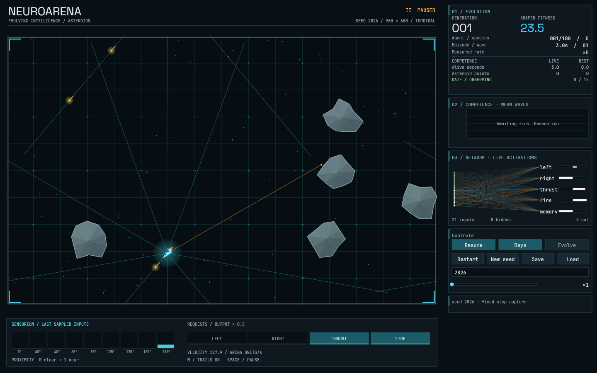
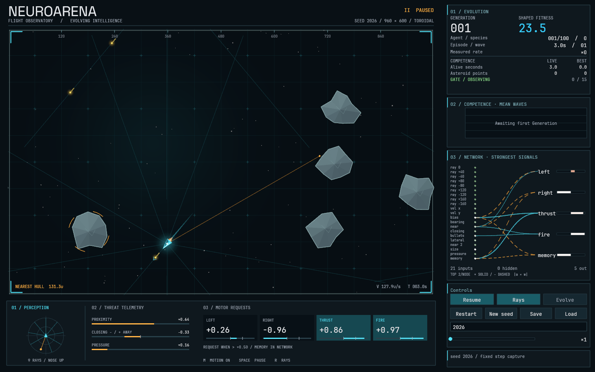

# NeuroArena — native flight observatory

2026-09-12 · Apple M5 · macOS 26.4.1 · Rust 1.98.1 · native winit / wgpu / Metal

## Result and scope

The running Rust application now connects perception, weighted signals, motor
requests, actual motion, and resolved collisions in one flight-observatory
presentation. Launch with `cargo run --release --bin neuroarena` from the repository.
Nothing was pushed, published, deployed, or committed.

The checkout was already dirty. Its inherited work included the observatory palette,
faceted Asteroids, triangle strokes and clipping, 4× MSAA, fonts, keyboard focus,
initial trails, and an offscreen capture example. Those changes were preserved.
This report's **before** is that inherited working tree rebuilt from source, not
an older Git screenshot. A stale initial release executable was detected and
excluded from the comparison. The original patch and source snapshot were kept
outside the repository at `/tmp/neuroarena-visual-audit/`.





Both captures: seed 2026, Generation 1, member 0, fixed step 180 (3.0 seconds),
1440×900 pixels, 1× display scale, paused presentation, Rays on. The upgraded probe
also reconstructs the actual preceding trail; no simulation state is fabricated.

## Audit: evidence and priorities

| Priority | Finding                                                                                             | Evidence and resolution                                                                                                                                                                                                                                                                                                                     |
| -------- | --------------------------------------------------------------------------------------------------- | ------------------------------------------------------------------------------------------------------------------------------------------------------------------------------------------------------------------------------------------------------------------------------------------------------------------------------------------- |
| High     | The Network's connection wedge conceals which inputs matter.                                        | Baseline Network panel; `panels::draw_network`. Replaced the full overlay with two strongest incoming weighted signals per target, deterministic tie-breaking, curved paths, input names when space permits, and an explicit magnitude/sign legend. This is a filtered Network view, not a claim to display all edges or explain causality. |
| High     | Typeface changes with display density.                                                              | `text::build_item` chose the font from the **physical** text size. A 12-point label at 2× became a display-font label. Added an explicit `Typeface` in text data; numerical and body text stay JetBrains Mono at every scale, with Space Grotesk selected deliberately for the wordmark. Regression-tested at 1×, 2× and 3×.                |
| High     | Sensor bars obscure spatial meaning; binary requests conceal actual activation.                     | Baseline lower strip. Replaced it with a Ship-relative polar instrument, signed nearest-threat/pressure meters, numerical motor requests, zero marks and action-threshold ticks. All use existing stored inputs and Network values.                                                                                                         |
| Medium   | Small Network panels lose names; tall windows leave unused dock space.                              | Baseline native resize and 900×560 capture. Extra dock height now goes to Network inspection. At short heights the diagram becomes five named numerical outputs; a 48-hidden-node fixture retains the inherited 12-node cap and reports the omitted nodes.                                                                                  |
| Medium   | Arena grid and long clear Rays compete with game objects; heading is easy to confuse with velocity. | Baseline Arena capture and motion inspection. Quieter grid/Rays, smooth illumination, coordinate ticks, a velocity chevron, and a bracket around the geometrically nearest hull improve hierarchy. The bracket is not presented as a neural target.                                                                                         |
| Medium   | Collisions lack a readable transient; trail length depends on observation cadence.                  | Baseline motion and `observatory::Trail`. Added real collision echoes; trails sample at no more than 60 Hz, retain at most 48 points and 0.8 simulation seconds. Discontinuous samples and seam jumps do not create across-Arena streaks.                                                                                                   |
| Medium   | Layered glow discs form visible bands; clipped intersections can drift fractionally outside a seam. | Exact golden fixture inspection and a failing new seam test. Radial lights now interpolate vertex alpha. Clipped intersections land exactly on their clipping boundary, including interpolated-color geometry.                                                                                                                              |

Architecture traced before editing:

- `App::advance` steps the watched World within its existing 8 ms budget; other
  Episodes evaluate through the existing worker pool. Pause, speed, restart,
  Generation completion and replay remain in `appstate`.
- `build_frame` reads the World, Run history, Genome and evaluated Network.
  `scene` transforms fixed 960×600 Arena coordinates into physical pixels;
  `ui::Layout` and `panels` use logical window coordinates, then apply display scale.
  Pointer coordinates use the inverse display-scale conversion before hit testing.
- `Painter` produces ordered triangle geometry and text anchors. `Renderer` uploads
  reused vertex buffers, resolves through its cached 4× MSAA attachment and draws
  the glyph atlas. `cosmic-text` shapes at final pixel size; atlas lookup avoids
  rerasterizing cached glyphs. Presentation geometry remains separate from physics.
- Existing telemetry includes 21 sampled inputs, five evaluated outputs, weighted
  connections, Ship velocity, Asteroid geometry, Episode statistics, Species count,
  Generation history and the Competence Gate. Confidence and causal attribution
  are unavailable and are not invented. Some ADR terminology describes candidate
  Sensorium changes; implementation uses the actual current 21-input controller.

Initial checks: strict Clippy passed; formatting failed in inherited observatory/HUD
edits; the workspace test run failed its existing Arena golden comparison (maximum
cell-channel difference 60). All other executed Arena tests passed. The source-based
baseline used the actual Apple M5 GPU, not a browser rendition.

## Direction and implementation decisions

Three directions were compared:

1. **Luminous arcade:** stronger bloom, saturated impacts and animated backdrops.
   Attractive in motion, but risks drowning out subtle behavior and sparse telemetry.
2. **Organic computation:** flowing or force-directed Networks and ambient generative
   forms. Expressive, but moving node positions impede stable comparison and can look
   like invented neural dynamics.
3. **Flight observatory — selected:** dark instrument surfaces, cyan perception and
   positive signals, amber energy and negative signals, white numerical hierarchy,
   quiet mineral geometry and restrained collision echoes. Stable spatial instruments
   make the pilot's behavior understandable during sustained observation.

The signature element is the perception → weighted signal → motor request relationship.
The polar display is nose-up and displays sampled normalized Ray distances; it is
not an independently simulated radar. Negative Network signals have dashed paths
as well as amber color. Requests have signed numbers and threshold ticks, and may
be active simultaneously: they are requests, not a claim about resolved turn motion.

Lyon was proven in the actual native GPU capture path before expanding the design.
Its tessellator and scratch mesh are reused by the Painter. Curves are flattened at
0.25 physical-pixel tolerance; all tessellated triangles use the same clipping,
color conversion, blending and MSAA path as the rest of the application.

The enduring parts of ADRs 0004/0005/0006 remain: native Rust/macOS, a graphics-free
simulation crate, deterministic independent streams, and a fixed logical Arena.
The historical system-font/plain-polygon presentation in ADR 0004 is superseded by
this explicitly authorized redesign. No engine or UI-framework migration was needed.

## Research and implementation evidence

Discovery began with [awesome-rust](https://github.com/rust-unofficial/awesome-rust),
[awesome-webgpu](https://github.com/mikbry/awesome-webgpu), and
[awesome-creative-coding](https://github.com/terkelg/awesome-creative-coding).
Additional collections included [awesome-wgpu](https://github.com/rofrol/awesome-wgpu),
[awesome-gamedev](https://github.com/Calinou/awesome-gamedev),
[awesome-dataviz](https://github.com/javierluraschi/awesome-dataviz), and the existing
repository's creative-coding research. The implementation files below were inspected;
list entries and READMEs were used only for discovery. Some already-downloaded research
artifacts in `/tmp/neuro-research` were inspected and reused as research evidence.

| Candidate and discovery chain                                               | Actual implementation; integration decision                                                                                                                                                                                                                                                                                                                                                                                                                                                                                                                         | License, compatibility and estimated cost before measurement                                                                                                                                                                                                                                                                              |
| --------------------------------------------------------------------------- | ------------------------------------------------------------------------------------------------------------------------------------------------------------------------------------------------------------------------------------------------------------------------------------------------------------------------------------------------------------------------------------------------------------------------------------------------------------------------------------------------------------------------------------------------------------------- | ----------------------------------------------------------------------------------------------------------------------------------------------------------------------------------------------------------------------------------------------------------------------------------------------------------------------------------------- |
| awesome-rust → native graphics; awesome-creative-coding → nannou → Lyon     | [Lyon stroke tessellator, pinned to the installed crate's commit](https://github.com/nical/lyon/blob/b456b143215a1942a617c4672776b68b9a30feee/crates/tessellation/src/stroke.rs) and [wgpu example](https://github.com/nical/lyon/blob/b456b143215a1942a617c4672776b68b9a30feee/examples/wgpu/src/main.rs). Adaptive path flattening emits triangle geometry through a vertex constructor. **Adopted `lyon_tessellation` 1.0.22** for arcs and curved/dashed connections; reused our existing wgpu renderer.                                                        | MIT OR Apache-2.0; [license](https://github.com/nical/lyon/blob/b456b143215a1942a617c4672776b68b9a30feee/LICENSE-MIT). GPU-version-independent tessellation; verified with wgpu 30.0.1, winit 0.30.13 and Rust 1.89. Estimated modest CPU tessellation cost and a few thousand triangles; measured below.                                 |
| awesome-webgpu → wgpu examples                                              | [MSAA line example, v30.0.1](https://github.com/gfx-rs/wgpu/blob/v30.0.1/examples/features/src/msaa_line/mod.rs). Multisampled attachment resolves into the presentation target; sample counts match pipelines. **Retained and verified inherited 4× MSAA**, rather than replacing it with a postprocess antialiasing filter.                                                                                                                                                                                                                                       | [MIT](https://github.com/gfx-rs/wgpu/blob/v30.0.1/LICENSE.MIT) option. Exact project version. Existing attachment is cached by viewport size; Retina attachment memory scales with physical pixel area.                                                                                                                                   |
| awesome-rust → egui / egui_graphs                                           | [egui Bézier demo](https://github.com/emilk/egui/blob/0.33.0/crates/egui_demo_lib/src/demo/paint_bezier.rs), [egui-wgpu manifest](https://github.com/emilk/egui/blob/0.36.2/crates/egui-wgpu/Cargo.toml), and [graph edge rendering](https://github.com/blitzarx1/egui_graphs/blob/main/crates/egui_graphs/src/draw/displays/default_edge.rs). These provide path drawing, selection and graph interaction. **Compared a full UI replacement; deferred it** because the selected design benefits more from explicit telemetry layout than general graph navigation. | egui MIT/Apache-2.0; egui_graphs [MIT](https://github.com/blitzarx1/egui_graphs/blob/main/LICENSE). Inspected egui 0.36.2 workspace uses wgpu 30 / winit 0.30.13 but Rust 1.95, above this project's 1.89 floor. Older 0.33 uses wgpu 27. Migration entails input/focus/text integration, not merely another draw call. No source copied. |
| awesome-dataviz → D3                                                        | [d3-shape bump curves, v3.2.0](https://github.com/d3/d3-shape/blob/v3.2.0/src/curve/bump.js). Connections use cubic control points halfway along the connecting axis, producing calm horizontal tangents. **Independently implemented the underlying cubic geometry** in Rust/Lyon with explicit sign patterns and weighted-signal filtering.                                                                                                                                                                                                                       | [ISC](https://github.com/d3/d3-shape/blob/v3.2.0/LICENSE). Browser code is a reference, not a runtime dependency. Bounded visible paths; source ranking reads actual enabled connections. The shortlist considered full edge drawing versus magnitude selection; selection better addresses the observed wedge.                           |
| awesome-webgpu → Three.js examples                                          | [UnrealBloomPass](https://github.com/mrdoob/three.js/blob/dev/examples/jsm/postprocessing/UnrealBloomPass.js). Threshold extraction, multiple downsampled horizontal/vertical blur targets, then weighted composition. **Rejected full-screen bloom for this direction**; independently implemented local radial vertex-alpha lights to preserve text and silhouettes.                                                                                                                                                                                              | [MIT](https://github.com/mrdoob/three.js/blob/dev/LICENSE). Transferable to wgpu, but would require more render targets/passes and bandwidth. That cost was an estimate, not a benchmark; bloom was not integrated.                                                                                                                       |
| awesome-webgpu → WebGPU Samples; existing creative-coding research → Proton | [particle shader](https://github.com/webgpu/webgpu-samples/blob/main/sample/particles/particle.wgsl) and [Proton Alpha behavior](https://github.com/drawcall/Proton/blob/master/src/behaviour/Alpha.js). GPU samples integrate particle position/lifetime and render billboards; Proton maps remaining energy to alpha. **Used the lifetime/fade concept, independently implemented**, for small collision echoes instead of a general emitter engine.                                                                                                              | WebGPU Samples [BSD-3-Clause](https://github.com/webgpu/webgpu-samples/blob/main/LICENSE.txt); Proton [MIT](https://github.com/drawcall/Proton/blob/master/LICENSE). No shader/source copied. GPU compute would be disproportionate for at most 24 echoes; CPU geometry uses existing draw batches.                                       |
| awesome-creative-coding → nannou                                            | [draw_polyline example](https://github.com/nannou-org/nannou/blob/master/examples/draw/draw_polyline.rs). Colored points, joined strokes and time-based generative motion. **Kept the native-path technique; did not adopt the whole creative-coding framework.**                                                                                                                                                                                                                                                                                                   | The inspected 0.20 workspace declares MIT OR Apache-2.0, but root license text was not found; treated as a reference only, with no source reuse. It uses wgpu 29 and Bevy 0.19, requiring a broader migration. Decorative time-driven values are not measured neural activity; our trails use actual positions and simulation time.       |

Added in this continuation: Lyon and its lockfile-resolved tessellation dependencies.
The inherited PNG dev dependency is used for evidence captures. No additional image,
icon or font assets were downloaded into the product. The inherited JetBrains Mono
and Space Grotesk fonts have individual OFL-1.1 notices in `app/assets/fonts/`;
[JetBrains Mono OFL](https://github.com/google/fonts/blob/main/ofl/jetbrainsmono/OFL.txt)
and [Space Grotesk OFL](https://github.com/google/fonts/blob/main/ofl/spacegrotesk/OFL.txt)
were checked separately. Keep those notices with redistributed fonts.
`cargo deny check` passes advisories, bans, licenses and sources; existing duplicate
transitive versions remain warnings.

## State, correctness and resource rules

`World::impacts()` is the only new simulation-facing surface: a non-consuming view
of up to five collisions from the last step (four possible Bullets plus Ship death).
The fixed array is cleared at the next step. It records positions after collision
resolution has already made its decision; it adds no RNG draw, physics branch,
fitness term, graphics dependency or save-format field.

- The app records watched impacts at ordinary speeds, caps echoes at 24, and expires
  them after 0.55 simulation seconds. Radial fragments are deterministic geometry.
- Pause freezes trails and echoes. Restart, New seed, Load, Evolve, and Episode/
  Generation identity changes clear them. Discontinuous time jumps clear trails.
  Echoes are suppressed above 16× instead of processing thousands of skipped events.
- Echoes draw seam copies and clip at the Arena edge. Trails reject across-seam
  segments. Neither changes collision geometry, logical dimensions or wrapping.
- The Network still limits visible hidden nodes to twelve and reports omissions.
  Incoming-signal selection keeps two entries per target rather than sorting all
  pairs against every other pair. Chart geometry retains the existing pixel-based
  sample bound; full Generation history belongs to the unchanged Run.

## Verification

Final commands:

```sh
cargo fmt --all -- --check
cargo test --workspace
cargo clippy --workspace --all-targets -- -D warnings
cargo build --workspace --release
cargo +1.89.0 check --workspace --all-targets --locked
cargo deny check
```

All passed (98 tests including the simulation doctest). The Arena golden was updated only after inspecting its exact new native
GPU fixture. Golden tolerance was not widened. New tests cover DPI-independent font
selection, signal ranking, trail cadence/lifetime, effect capacity, paused clocks,
transition resets, seam clipping, collision records and responsive layout.

For stronger reproducibility, a temporary oracle compared the original `HEAD` sim
source with the upgraded sim. Seeds **1, 42, 2026**, population 100, one worker,
three Generations each: every Episode outcome and each post-breeding Genome's nodes
and connections were printed at full Rust Debug precision and compared byte-for-byte.
Both outputs have SHA-256:

`530abd340c265e1900c2eb17d8de06a3c857e1fbb089cf34cf3b5e5691342b51`

The normal seed-2026 headless report also matches all three Generation results and
**432,325 steps**. Baseline measured 2.586 million steps/s; upgraded measured 2.836
million steps/s. These short wall-clock timings are noisy and are **not evidence
of a simulation speedup**. Existing parallel-worker reproducibility tests passed.

Native inspection covered ordinary motion, pause/resume, 1× and accelerated speeds,
Rays, reduced motion, seed entry, restart, saved-Genome replay, returning to evolution,
Save, resized windows, dense scenes, and a long session reaching Generation 1,162
with 55 hidden nodes. The tool screenshots were inspected in the live macOS window;
the durable PNGs below are reproducible offscreen renders of the same native stack.

The temporary macOS review bundle initially launched with `/` as its working directory.
Relaunching it against Documents blocked in the OS directory-open call (captured in
`native-sample.txt`); the cause was not conclusively established. Replay and Save
were then verified using a copied save in a temporary working directory. Product
save paths remain relative to the launch directory, as before. The normal documented
launch is from the repository with Cargo. No permissions/settings were changed.

### Performance evidence

The probe times 120 warmed, synchronized renderer submissions after ten warm-up
frames on the same Apple M5. It includes text preparation/upload and GPU completion,
but excludes scene assembly and simulation; these are **not end-to-end display
frame-time percentiles**. Budget for the interactive experience: 16.7 ms/frame;
no claim is made about a specific refresh rate from these measurements alone.

| Capture                                | Renderer p50 | Renderer p95 |
| -------------------------------------- | -----------: | -----------: |
| Inherited baseline, 1440×900, step 180 |     1.080 ms |     8.325 ms |
| Upgraded, 1440×900, step 180           |     2.070 ms |     9.290 ms |
| Upgraded, 900×560                      |     0.485 ms |     3.253 ms |
| Upgraded, 2880×1800 / 2×               |     1.440 ms |     7.774 ms |
| 48-hidden-node fixture, 1440×900       |     0.664 ms |     3.301 ms |
| First impact + six steps, step 268     |     0.658 ms |     3.382 ms |

These are individual runs with visible scheduling variance. They support a frame
budget check, not a statistically significant before/after speed claim. The table uses the final signed-path captures. The normal-scene median rose by
about 1 ms and p95 by about 1 ms; both remain inside the stated renderer budget.
The final scene contains 3,232 triangles and 848 glyphs versus the inherited
2,160 triangles and 600 glyphs. This additional detail has a measured cost;
the other runs illustrate why no broad speedup claim is justified.

Native RSS rose with the long evolving workload: about 100 MiB in early ordinary
play, approximately 517 MiB at Generation 1,162 / 55 hidden nodes. During a subsequent
minute paused at that state RSS changed only about 16 KiB. The inherited application
had reached approximately 372 MiB at Generation 1,664 / 39 hidden nodes. These are
**different evolving workloads**, not a controlled renderer memory comparison.
Inspection found bounded new cosmetic containers, reused GPU buffers/attachments,
and unchanged growing Run history and innovation-indexed Network storage. A heap
attribution study or multi-hour leak-free claim was not performed.

## Captures and reproduction

Files are under `docs/visuals/2026-09-observatory/`:

- `before.png`, `after.png`: matched normal scene.
- `retina.png`: 2880×1800 rendering of the same 1440×900 logical composition.
- `small.png`: 900×560; named output snapshot instead of an unreadable tiny diagram.
- `dense.png`: clearly labeled, deterministic 48-hidden-node topology stress fixture.
- `impact.png`: a real seeded Asteroid collision and its echo at fixed step 268.

```sh
# output, physical width, physical height, steps (or "impact"), DPR,
# completed Generations, member index, optional "dense" topology fixture
cargo run --release -p neuroarena-app --example visual_probe -- /tmp/neuro.png 1440 900 180
cargo run --release -p neuroarena-app --example visual_probe -- /tmp/retina.png 2880 1800 180 2
cargo run --release -p neuroarena-app --example visual_probe -- /tmp/impact.png 1440 900 impact
cargo run --release -p neuroarena-app --example visual_probe -- /tmp/dense.png 1440 900 180 1 0 0 dense
```

Raw logs, the before-source snapshot, reproducibility oracle, native process sample
and intermediate captures remain in `/tmp/neuroarena-visual-audit/`; they are not
product dependencies. No large recording or research checkout was added to Git.

Remaining limits: no recording API was exposed by the native inspection tool; no
multi-hour memory/heap attribution study, calibrated display measurement or complete
accessibility-tree implementation was undertaken. The GPU-drawn controls retain the
inherited keyboard navigation and tested hit regions. The existing glyph-atlas
rollover path was inspected but was not subjected to exhaustive font/resize churn.
